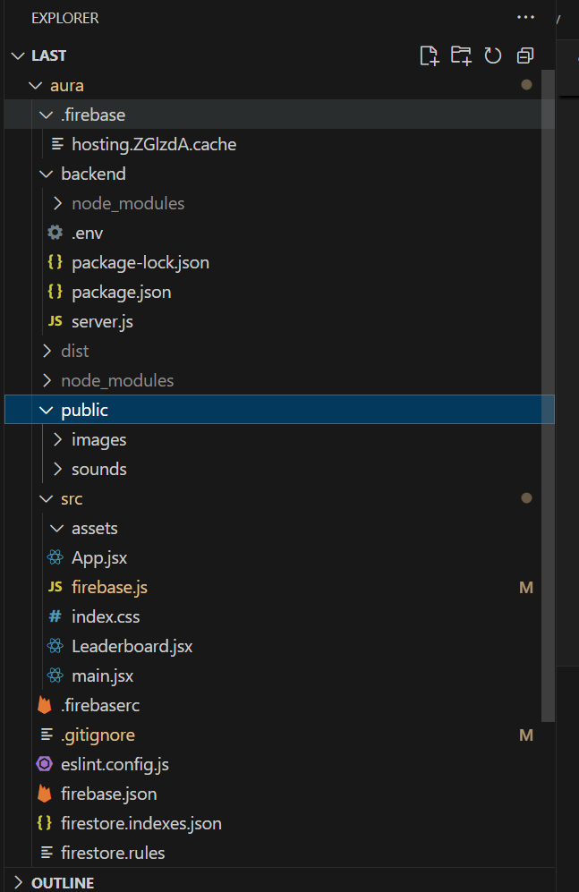
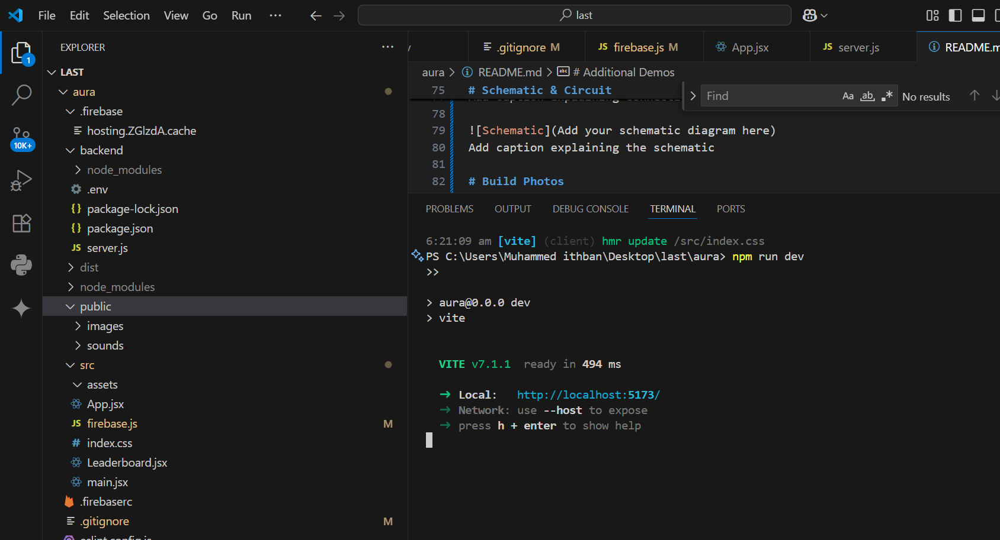
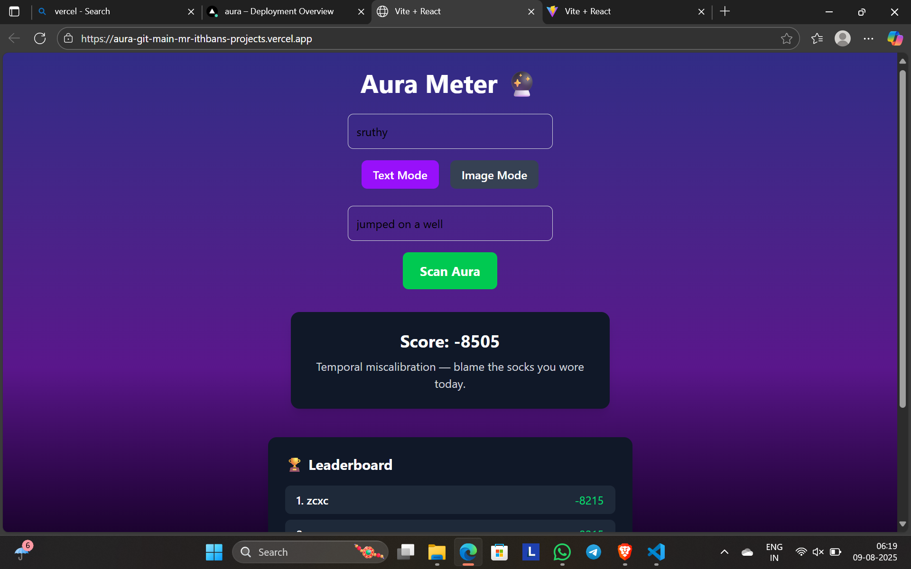

# [Aura Measuring web] 🎯

## Basic Details

### Team Name: [LAB]

### Team Members

- Team Lead: Muhammed Ithban - CUSAT
- Member 2: Muhammed Irfan - CUSAT

### Project Description

Aura reader who gives short, jokey reasons about someone’s aura. Always respond with a JSON containing a score (-10000 to 10000) and a brief, humorous explanation of their aura plus or minus moment.

### The Problem (that doesn't exist)

WE CAN MEASURE OUR HEIGHT BUT NOT AURA

### The Solution (that nobody asked for)

Measuring aura using Openai

## Technical Details

### Technologies/Components Used

For Software:

- javascript
- React
- Firebase
- Express
- openai

### Implementation

For Software:

# Installation

npm install

# Run

npm run dev

### Project Documentation

For Software:### Project Documentation  
For Aura Meter:

This project analyzes user inputs (text or images) to generate a humorous aura score along with a witty reason. It uses a React frontend with Firebase for leaderboard management and a Node.js backend that leverages OpenAI’s GPT-4o-mini model for aura analysis.

- _Frontend:_ React, TailwindCSS, Firebase Firestore
- _Backend:_ Express, Multer, OpenAI API
- _Features:_ Text and image aura scanning, animated progress, audio effects, and a dynamic leaderboard.

# Screenshots (Add at least 3)

Add caption explaining what this shows

Add caption explaining what this shows

Add caption explaining what this shows

# Diagrams

Add caption explaining your workflow

For Hardware:

# Schematic & Circuit

Add caption explaining connections

Add caption explaining the schematic

# Build Photos

List out all components shown

Explain the build steps

Explain the final build

### Project Demo

# Video

[Add your demo video link here]
Explain what the video demonstrates

---

Made with ❤ at TinkerHub Useless Projects

